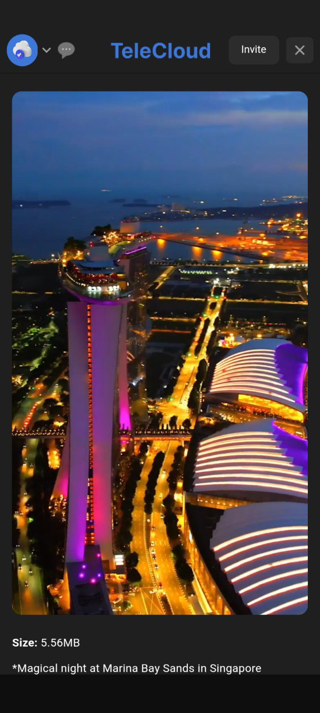
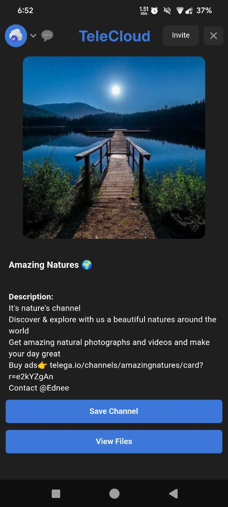
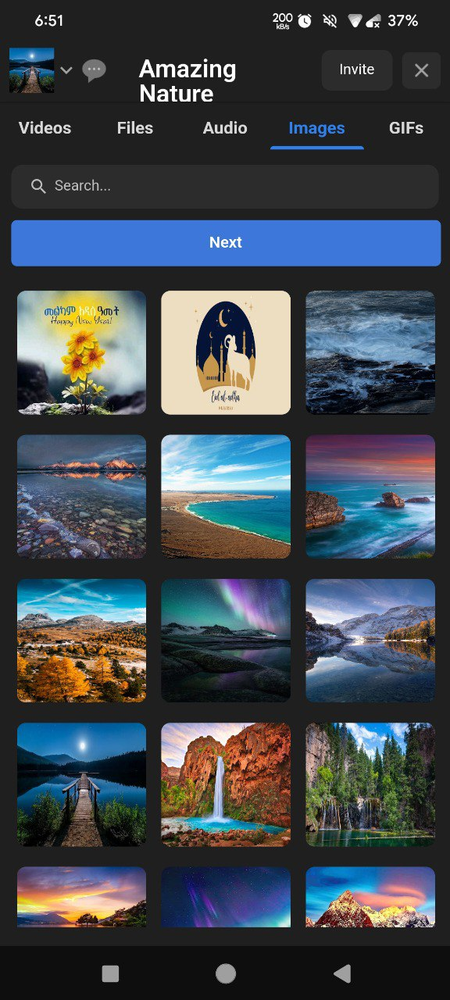
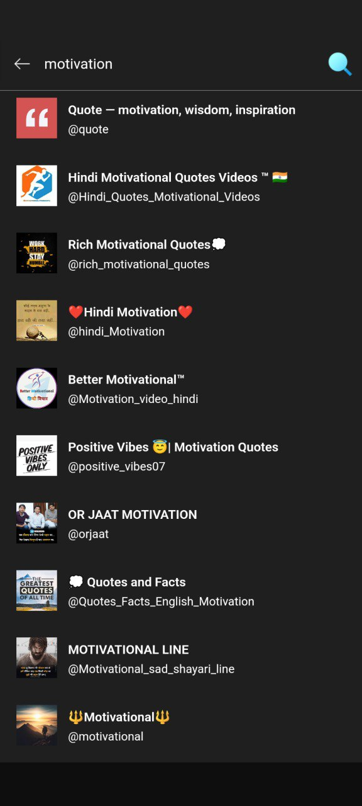
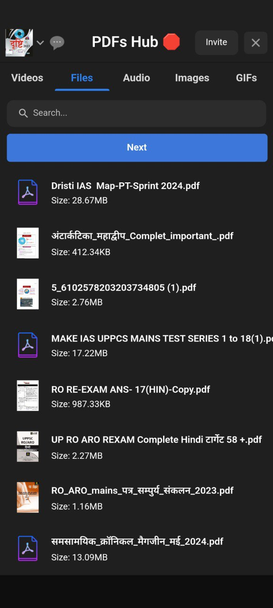

# TeleCloudBot


#### TeleCloudBot provide mini-Telegram management on the Switch platform with the power of mini-apps.

[Check TeleCloud on Switch](https://iswitch.click/telecloud_bot)

---

## Features
- login with your account.
- Search and save channels.
- Stream any video file.
- folders management.
- Open pdf files without download.
- Sharable file links.

## Screenshots
<p float="left">


</p>
<p float="left">


</p>

<p float="left">

</p>

## Installation
- python3.10 or greater is required!

```bash
pip3 install -r requirements.txt
```

## Setting up `.env` file
- Create a Switch Bot and paste token as `BOT_TOKEN`
- Login on `my.telegram.org` to get `API_ID` and `API_HASH`
- `TG_BOT_TOKEN`: telegram bot token to use for files publically accessible.
- `WEB_SERVER_BIND_ADDRESS`: address where the server is running
- Create a firebase database, and store the admin file as `service.json`

## Starting bot
```bash
python3 main.py
```

## Based on
- [TG-FileStreamBot](https://github.com/EverythingSuckz/TG-FileStreamBot/)